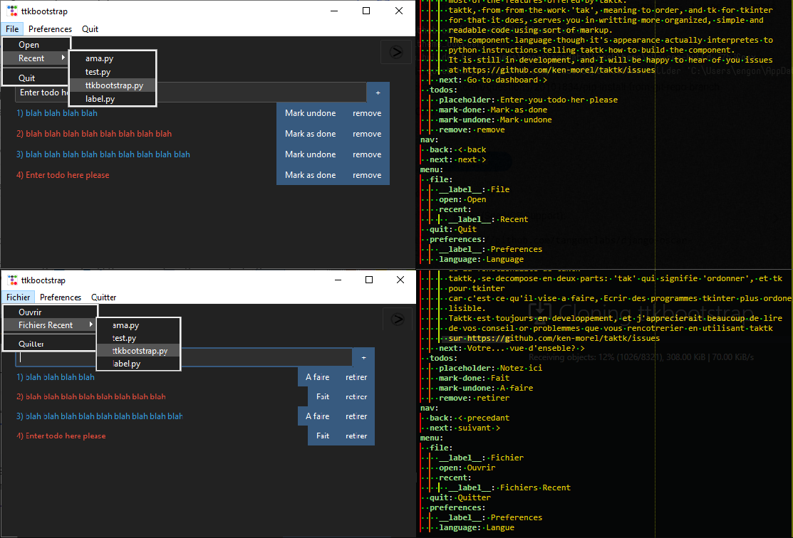
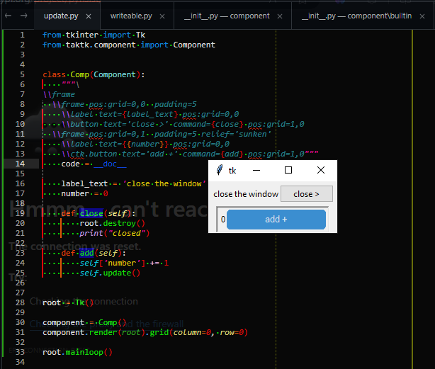

# taktk

taktk from from the [bulu](https://wikipedia.com/wiki/bulu) word
_tak_, meaning to order, and _tk_ for `tkinter`.

taktk aims to give you a more orderly, easy and responsive way to build tkinter
pages.

Taktk adds new functions permitting you to build better applications including

## simple component syntax

taktk brings in components renderable in tkinter widgets,

```latex
\frame padding=20
    \frame pos:grid=0,0 pos:sticky='nsew'
        \entry width=80 pos:grid=0,0 text={{entry}} pos:sticky='nsw' bind:Key-Return={add_todo}
        \button text='+' command={add_todo} pos:grid=1,0 pos:sticky='nse'
    \frame pos:grid=0,1 pos:sticky='nsew'
        !enum todos:(idx, todo)
            \label bootstyle={'info' if todo.done else 'danger'} text={str(idx + 1) + ') ' + todo.desc} pos:grid={(0, idx)} pos:xweight=10 pos:sticky='nswe' bind:1={toggler(idx)} bind:3={popup_menu(idx)}
            \button text={_('pages.todos.mark-done') if not todo.done else _('pages.todos.mark-undone')} command={toggler(idx)} pos:grid={(1, idx)} pos:sticky='nse'
            \button text=[pages.todos.remove] command={popper(idx)} pos:grid={(2, idx)} pos:sticky='nse'
```

## text translation support

Using yaml and taktk dictionaries, easily build apps available in different languages




## styled notifications


# examples
## hello world example

Here the example in [examples/simple.py](examples/simple.py)

```python
from tkinter import Tk
from taktk.component import Component


class Comp(Component):
    """\
\\frame
  \\frame pos:grid=0,0  padding=5
    \\label text={label_text} pos:grid=0,0
    \\button text='close >' command={close} pos:grid=1,0
  \\frame pos:grid=0,1  padding=5 relief='sunken'
    \\label text={{number}} pos:grid=0,0
    \\ctk.button text='add +' command={add} pos:grid=1,0"""
    code = __doc__

    label_text = 'close the window'
    number = 0

    def close(self):
        root.destroy()
        print("closed")

    def add(self):
        self['number'] += 1
        self.update()


root = Tk()

component = Comp()
component.render(root).grid(column=0, row=0)

root.mainloop()
```



> [!WARNING]
> The component building language is still in development and may be extremely
> strict
